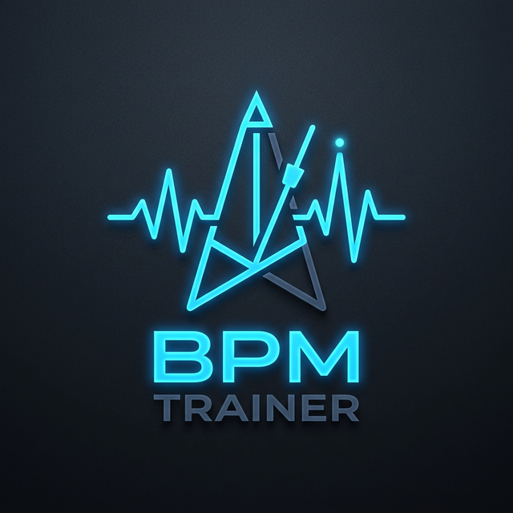

# 🥁 BPM Trainer

A professional-grade rhythm training and BPM detection tool built with React and the Web Audio API. Perfect for musicians, producers, and rhythm game enthusiasts looking to sharpen their timing.



## ✨ Features

- **🎯 Two Training Modes**:
  - **Rhythm Master**: Practice keeping up with a fixed target BPM. Get real-time feedback on every tap.
  - **BPM Detector**: Tap along to any song or rhythm to accurately detect its beats per minute.
- **🔊 High-Precision Metronome**: Built-in audio metronome with customizable time signatures (2/4 to 7/4).
- **📊 Real-Time Grading**: Music-game style feedback system:
  - **PERFECT**: Sub-30ms error (customizable)
  - **GREAT**: Within 1.5x of perfect window
  - **GOOD**: Within 2.5x of perfect window
  - **MISS**: Late or early taps
- **📐 Device Calibration**: Built-in calibration test to account for hardware audio/input latency, ensuring millisecond-perfect accuracy.
- **🌈 Visual Feedback**:
  - Dynamic screen flashes on accurate hits.
  - Moving **Visual Rhythm Bar** to help anticipate beats.
  - Detailed history log of timing errors.
- **💾 Persistent Settings**: Your BPM, time signature, calibration offsets, and preferences are automatically saved to local storage.

## 🚀 Getting Started

### Prerequisites

- [Node.js](https://nodejs.org/) (v18 or higher recommended)
- [npm](https://www.npmjs.com/) or [yarn](https://yarnpkg.com/)

### Installation

1. Clone the repository:

   ```bash
   git clone https://github.com/your-username/bpm-trainer.git
   cd bpm-trainer
   ```

2. Install dependencies:

   ```bash
   npm install
   ```

3. Start the development server:
   ```bash
   npm run dev
   ```

## 🛠️ Tech Stack

- **Framework**: [React 19](https://react.dev/)
- **Build Tool**: [Vite](https://vitejs.dev/)
- **Language**: [TypeScript](https://www.typescriptlang.org/)
- **Audio**: [Web Audio API](https://developer.mozilla.org/en-US/docs/Web/API/Web_Audio_API) for low-latency feedback.
- **Styling**: Vanilla CSS with modern flex/grid layouts and CSS variables.

## 🔧 Configuration

Access the **Settings** (gear icon) to:

- Toggle between **Master** and **Tap-to-BPM** modes.
- Set a specific **Target BPM**.
- Adjust the **Time Signature**.
- **Timing Strictness**: Choose how close your taps must be to the beat for a "PERFECT" score.
- **Audio Sync**: Fixes delays from Bluetooth headphones or screen lag. Use the built-in calibration test to find your perfect offset.

### ❓ Why Sync Matters?

In rhythm training, milliseconds matter. Standard devices have built-in delays:

- **Bluetooth**: 100ms - 300ms delay.
- **Touchscreens**: 20ms - 50ms processing lag.
  Without **Audio Sync**, you might tap perfectly but the app will think you are late. Calibrating ensures the app judges _your_ skill, not your hardware's speed.

## 📜 License

MIT
